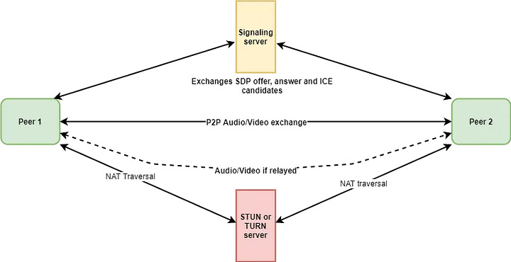
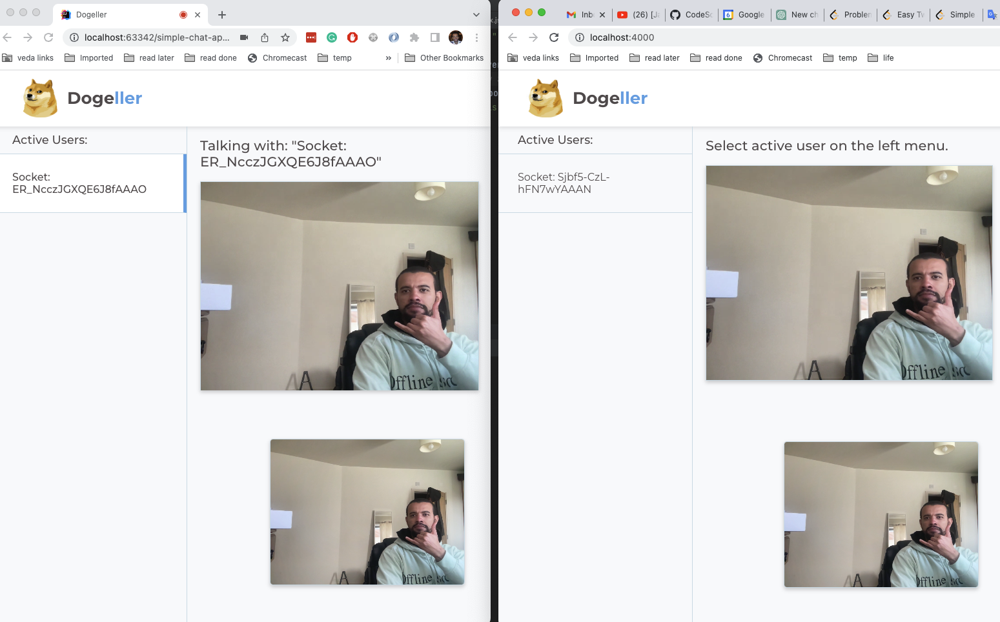

# Video-chat-app

This is a video chat app using WebRTC and WebSockets. It is built using Node.js, Express, and Socket.io.

We implemented a signaling server using Socket.io to exchange the WebRTC signaling messages (offer, answer, and candidate) between the peers. 
The signaling server is also responsible for broadcasting the list of active users to all connected users.

The WebRTC peer-to-peer communication requires an ICE server to establish a connection between the peers. In this app, we used the Google STUN server.

## Live Demo
You can try the UI [here](https://apssouza22.github.io/video-chat-rtc/public/)    

## Getting started

First install the required packages:

```code-block:: console

    $ pip install aiohttp aiortc opencv-python aiohttp_cors
```

When you start the example, it will create an HTTP server which you
can connect to from your browser:

```code-block:: console
    $ cd python 
    $ python server.py
```

### Node js version

We provide a Node js version of the signaling server. To run the Node js version, follow the steps below:

- `npm install`
- `npm start`
- Access the http://localhost:8881 from two different browsers
- Click on the one of the active users to start a video chat

## WebRTC Flow


## Video Chat App



## Docker
- `docker build -t video-chat-app .`
- `docker run -p 8881:8881 video-chat-app`


